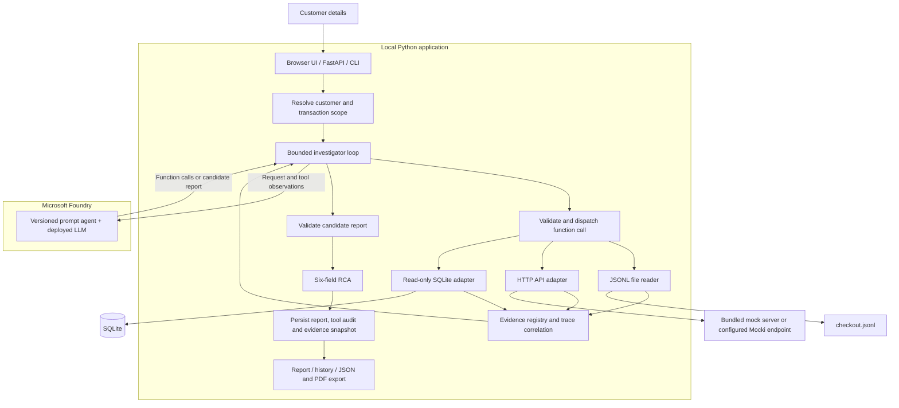

# Transaction RCA agent: implemented architecture

The application implements the Sphere IT assessment as a single investigator agent registered in Microsoft Foundry. It accepts a customer's transaction details, retrieves actual file, HTTP and database records, correlates exact trace/attempt identifiers, and returns a validated root cause report. This document describes the code in this submission.

## Requirement coverage

| Assessment requirement | Implementation | Demonstration |
|---|---|---|
| Accept customer details | Pydantic request with customer ID, optional transaction ID, time window and reported issue | UI form or `POST /api/analyze` |
| Retrieve file logs | Read `data/logs/checkout.jsonl`; preserve file/line locator | `read_file_events` tool and evidence records |
| Integrate a mock API | HTTPX calls a separately runnable mock HTTP server; configurable Mocki-compatible endpoint | `fetch_api_events`; same adapter supports local or hosted HTTP |
| Connect directly to lightweight local DB | Python `sqlite3` opens `data/transactions.db` read-only; parameterized SQL | `query_database_events` and SQLite audit records |
| Correlate by traceId | Exact customer, transaction, trace and attempt associations | Trace correlation panel, retry scenario TX9005 |
| LLM analyzes and chooses tools | Registered Foundry prompt agent with function definitions | Foundry mode, tool calls and conversation ID |
| Find failures and explain root cause | Model interprets observations; application validates evidence integrity | Root cause, limitations and failure flow |
| Return six named fields | Strict provider output schema plus local validation | JSON download and HTTP response |
| Run with Azure and explain code | Agent definition/model in Foundry; custom tool executor on laptop | Live UI and module walkthrough |

The bundled HTTP mock is the assessment's permitted alternative to Mocki. It makes the demonstration reproducible without an external mock account. Mock business events still travel over an actual HTTP request. The SQL source is a direct database connection.

## Execution boundaries



Foundry stores the agent definition and performs model inference. Local Python executes function calls against the laptop's files and database, then returns observations to the same Foundry conversation. The UI and custom tools run locally; this submission does not claim that the entire web application is hosted in Azure. This boundary reconciles the local DB requirement with the Foundry demonstration.

## Investigation lifecycle

1. Validate the request: timezone-aware timestamps, maximum 24-hour window and bounded identifiers/text.
2. Query SQLite for transactions belonging to the requested customer in that window. Reject mismatched ownership with 404. Multiple matches produce 409 and a transaction chooser in the UI. Exactly one match proceeds.
3. Read the stored transaction-to-trace/attempt mappings. These become immutable investigation boundaries. The snapshot transaction status supplies context; historical events establish what happened.
4. Create a fresh evidence registry and model conversation for this investigation.
5. Send the authorized scope and reported issue to the registered Foundry agent. The agent chooses tools and follow-up queries from observations.
6. Execute allowlisted calls locally. Require broad retrieval and complete pagination from all three sources before permitting a complete finding. Source errors and truncation remain explicit.
7. Normalize and preserve records with source locators and SHA-256 hashes. Correlate observations and return them to the agent.
8. Validate the candidate RCA. Permit one model repair attempt; otherwise return an explicit incomplete report and failure outcome. Provider failures never switch silently to replay.
9. Atomically save `outputs/<investigationId>.json`. Return exactly the six required report fields. Execution diagnostics travel in response headers and the separate audit endpoint.

## Data and tool contracts

The seed command creates synthetic fixtures separately from the read-only investigator. SQLite has these actual tables:

```text
customers(customer_id)
transactions(transaction_id, customer_id, created_at, final_status)
transaction_traces(transaction_id, trace_id, attempt_id)
events(event_id, customer_id, transaction_id, trace_id, attempt_id,
       timestamp_utc, event_json)
```

The `events` JSON holds typed historical facts: available/requested balance at the decision time, error code, commitment outcome or connection pool observations. Indexes support customer/time discovery and scoped trace retrieval. Foreign keys are enabled during fixture generation. SQLite reads use URI `mode=ro` and predefined SQL parameters.

| Agent tool | Arguments | Result |
|---|---|---|
| `read_file_events` | Optional traceId, attemptId and cursor | Normalized checkout records with file/line evidence |
| `fetch_api_events` | Optional traceId, attemptId and cursor | Payment events from a real HTTP snapshot |
| `query_database_events` | Optional traceId, attemptId and cursor | Historical database evidence |
| `get_evidence` | Evidence IDs already observed | Exact evidence objects for inspection/citation |

The model cannot provide paths, URLs, SQL or another customer's identity to these tools. Operators configure file locations and the API URL. The API adapter snapshots its response once per investigation and filters static mock payloads locally; it does not assume the remote service honors query parameters.

## Correlation and causal confidence

Every admitted record must match the customer and resolved transaction, fall in the requested window, and satisfy stored trace/attempt associations. A missing trace is usable only with an explicit recorded attempt mapping. Timestamp proximity alone cannot authorize an event.

Multiple traces can belong to a retried transaction through the `transaction_traces` table. The UI groups evidence by attempt and displays trace IDs. Explicit `causedByEventId` references create causal edges; timestamps determine display chronology. Conflicting checkout outcomes for one attempt remain flagged.

The LLM explains the deepest cause supported by those observations. A recorded rejection and its inputs may establish a cause. A generic upstream timeout only establishes a symptom when provider-level cause evidence is missing. Complete retrieval is different from sufficient evidence. Successful retry evidence establishes recovery, without establishing why the original attempt timed out.

## Output and validation

The six top-level fields are `customerId`, `transactionId`, `rootCause`, `failureFlow`, `evidence`, and `recommendation`. Their complete contract is [rca-output.schema.json](docs/contracts/rca-output.schema.json).

`rootCause` contains a status, explanation, evidence IDs and limitations. Status is `identified`, `suspected`, `insufficient_evidence`, or `no_failure`. Flow steps and recommendations cite evidence; recommendations are proposed actions, never executed remediation.

Local checks enforce schema, ownership, unique/resolvable citations, unchanged evidence excerpts and metadata, sequential flow steps, cited services and equivalent timestamp instants. Complete findings require complete three-source coverage and no material terminal conflict. No-failure requires positive success evidence and no failed checkout evidence in the report. Citation checks establish reference integrity; they do not prove every natural-language conclusion. Live case evaluation and reviewed reports remain necessary.

## Runtime and failure handling

`foundry` uses the registered agent and real LLM. `replay` is an explicit deterministic test double exercising the same real source I/O. Each saved report displays its own mode, including when reopened from history.

Execution is bounded by time, model turns, tool calls, observation characters, source bytes, record bytes and event count. Default source/record caps are 2 MB/8 KB. HTTP requests use timeouts. Budgets and incomplete source reads result in qualified or incomplete findings. There is no retry/payment/balance mutation tool.

The browser distinguishes execution outcome from finding status and exposes coverage, tool calls, timings and Foundry conversation IDs. A failed audit fetch preserves the report while showing that audit data is unavailable. Saved reports can be reopened without another model invocation. JSON exports retain exactly six fields; print/PDF exports include the displayed execution mode and audit details.

## API and security boundary

| Endpoint | Purpose |
|---|---|
| `POST /api/analyze` | Investigate a validated customer request |
| `GET /api/investigations?customerId=...&limit=20` | Customer-filtered summaries, newest first |
| `GET /api/investigations/{uuid}` | Saved report and evidence audit |
| `GET /api/scenarios` | Synthetic demonstration requests |
| `GET /health` | Local configuration health; not a live cloud probe |
| `GET /docs` | Interactive OpenAPI contract |

The app binds to loopback and assumes one trusted local user. Customer filtering is scope checking, not authenticated tenant authorization. Shared deployment requires caller authentication, per-user audit authorization, durable job execution, retention controls and operational monitoring. Credentials stay outside the source bundle. Logs and user issues are treated as untrusted input. UI text is inserted as text nodes; scripts and styles are served from local static assets under a Content Security Policy.

## Interview walkthrough

Read `models.py` → `sources.py` → `tools.py` → `foundry.py` → `engine.py` → `evidence.py` → `validation.py` → `api.py`. Run TX9001 for a supported wallet decline, TX9005 for retry correlation, TX9003 for uncertainty and TX9007 for conflicting records. See [INTERVIEW_GUIDE.md](docs/INTERVIEW_GUIDE.md), [DEMO_RUNBOOK.md](docs/DEMO_RUNBOOK.md) and [VERIFICATION.md](docs/VERIFICATION.md) for commands and measured results.
